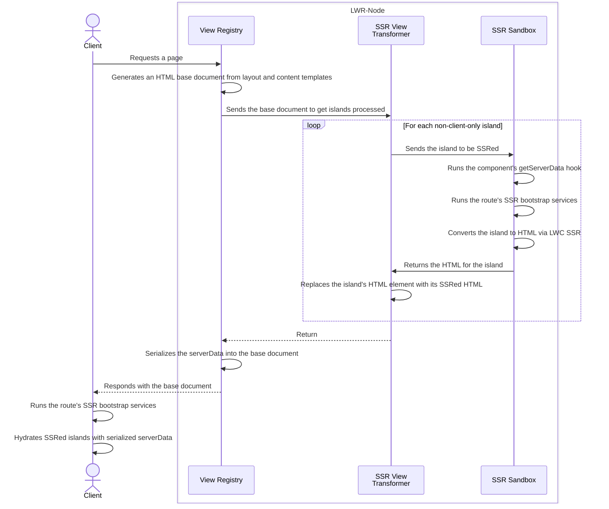

# Server-side rendering (SSR) in LWR

-   [Server-side rendering (SSR) in LWR](#server-side-rendering-ssr-in-lwr)
    -   [Overview](#overview)
        -   [What is SSR?](#what-is-ssr)
        -   [Why use SSR?](#why-use-ssr)
    -   [Using SSR with LWR](#using-ssr-with-lwr)
        -   [Turn on SSR](#turn-on-ssr)
        -   [Building SSR pages](#building-ssr-pages)
        -   [SSR detection](#ssr-detection)
        -   [Loading data during SSR](#loading-data-during-ssr)
            -   [LWR Cache](#lwr-cache)
            -   [JSON](#json)
            -   [Markup](#markup)
            -   [Data example](#data-example)
        -   [Caching](#caching)
        -   [Timeouts](#timeouts)
    -   [Islands](#islands)
        -   [Client hydration](#client-hydration)
        -   [Skip SSR](#skip-ssr)
    -   [Routing](#routing)
    -   [Limitations](#limitations)
        -   [Portability](#portability)
        -   [Synchronous code](#synchronous-code)
        -   [Styling](#styling)
        -   [Slots](#slots)
    -   [Debugging](#debugging)
        -   [Debug logging](#debug-logging)
        -   [Local dev](#local-dev)
    -   [Diagrams](#diagrams)
        -   [Sequence](#sequence)

## Overview

### What is SSR?

[Lightning Web Components (LWC)](https://lwc.dev/) is a framework for creating client-side applications. However, these components can also be rendered as an HTML string on the **server**. LWR sends these strings to the client, where they may be ["hydrated"](#client-hydration) to create an interactive web app.

See the following documents from LWC:

-   [SSR Dev Guide](https://lwc.dev/guide/ssr)
-   [SSR Rehydration](https://github.com/salesforce/lwc-rfcs/blob/master/text/0117-ssr-rehydration.md)

### Why use SSR?

With SSR, the browser does not need to wait for all the JavaScript to download and execute before displaying component markup. This results in faster time-to-content, especially on slower devices or internet connections. It also makes the content accessible to search engine crawlers, improving SEO.

That said, SSR is best used for apps where time-to-content is important, such as B2C websites. The benefits of SSR should be weighed against the costs: higher server load, increased build & deployment complexity, developing server-compatible component code.

## Using SSR with LWR

Learn how to use SSR in LWR apps.

### Turn on SSR

SSR is activated on a per-route basis by changing `bootstrap.ssr` to `true`.

```json
// my-app/lwr.config.json
{
    "routes": [
        {
            "id": "ssr-page",
            "path": "/category/:category",
            "contentTemplate": "$contentDir/page.html",
            "bootstrap": {
                "ssr": true
            }
        }
    ]
}
```

> See an example app which uses SSR in the [LWR recipes repository](https://github.com/salesforce-experience-platform-emu/lwr-recipes/tree/main/packages/ssr).

### Building SSR pages

When a route with `bootstrap.ssr` is requested, LWR will use LWC APIs to SSR each **root component** on the page. This is done whether the page is generated at runtime, or pre-built using `generateStaticSite()`.

> A "root component" is any lwc in an app route's [content template, layout template](https://github.com/salesforce-experience-platform-emu/lwr-recipes/tree/main/packages/templating#templates), or [`rootComponent` configuration](https://github.com/salesforce-experience-platform-emu/lwr-recipes/blob/main/doc/config.md#routes).

LWR will automatically pass any root component attributes from a [template](https://github.com/salesforce-experience-platform-emu/lwr-recipes/tree/main/packages/templating#templates) as [public properties](https://developer.salesforce.com/docs/component-library/documentation/en/lwc/reactivity_public) during SSR. For example, `my/root` will receive `{ limit: '10' }`.

```html
<!-- my-app/src/content/page.html -->
<section>
    <!-- "limit" is a template attribute -->
    <my-root limit="10"></my-root>
</section>
```

### SSR detection

Check the `import.meta.env.SSR` flag to determine where component code is running. On the server it will be `true`, and on the client it will be [falsy](https://medium.com/coding-at-dawn/what-are-falsy-values-in-javascript-ca0faa34feb4). Component developers can use this flag to control in which environment code is run:

```js
// pivot on the SSR flag
export default class App extends LightningElement {
    connectedCallback() {
        if (import.meta.env.SSR) {
            // run code on the server
        } else {
            // run code on the client
        }
    }
}
```

When using typescript, LWR augments the global `ImportMeta` interface in the `@lwrjs/types` package:

```ts
declare global {
    interface ImportMeta {
        readonly env: {
            SSR: boolean;
        };
    }
}
```

### Loading data during SSR

Many components depend on external data and resources. LWR provides a [`getServerData()` hook](https://developer.salesforce.com/docs/platform/lwr/guide/lwr-enable-ssr-site.html#load-data-during-ssr) for developers to fetch data on the server. During SSR, LWR calls the `getServerData()` hook for each **root component**, then serializes the resulting data into the page document as either [JSON](#json) or [markup](#markup).

If an error is thrown from `getServerData()`, rendering will fail and the server will return an HTTP 500 error for the page request. If this is undesirable, catch any errors thrown while fetching data and return default values from `getServerData()`.

> **Important**: `getServerData()` is **only** run for root components.

```ts
type GetServerDataHook = (context: SsrRequestContext) => Promise<SsrDataResponse>;

interface SsrRequestContext {
    // props from template attributes
    props: Json;
    // URL for the request
    url: string;
    // values from a parameterized route defined in lwr.config.json
    params: { [key: string]: string };
    // search parameters from the request URL
    query: { [key: string]: undefined | string | string[] };
    // locale string for the request, eg: 'en-US'
    locale: string;
    // base path for the request, eg: '/shop'
    basePath: string;
    // cross-request cache
    crossRequestCache: { [key: string]: any };
}

interface SsrDataResponse {
    props?: { [prop: string]: Json }; // JSON serializable properties for the root component
    markup?: {
        // HTML serializable data to contribute to the <head> markup
        title?: string; // page <title>
        meta?: {
            // <meta> tags
            name?: string;
            httpEquiv?: string;
            content?: string;
        }[];
        links?: {
            // <link> tags
            href: string;
            as?: string;
            rel?: string;
            fetchpriority?: 'high' | 'low' | 'auto';
        }[];
        scripts?: { body: string }[]; // for security, all scripts are inlined with `type="application/ld+json"`
        styles?: { body: string; id?: string }[]; // <style> tags
    };
    cache?: {
        ttl?: string | number; // time-to-live: time string or number of seconds
    };
}

type Json = undefined | null | boolean | number | string | Json[] | { [prop: string]: Json };
```

In LWR, the SSR process runs in a secure sandbox. This sandbox supports `globalThis.fetch` so developers can use `fetch()` in their `getServerData()` hooks as if the module is being executed in a browser.

#### LWR Cache

`SsrRequestContext.crossRequestCache` provides access to a global cache which is preserved across requests. The component can access or update new data to the global cache in the `getServerData()` hook.

> **Warning**: The global cache is shared across requests within an LWR application, so do not use it to store any sensitive information.

#### JSON

LWR passes this data to the root component as [public properties](<(https://developer.salesforce.com/docs/component-library/documentation/en/lwc/reactivity_public)>) during SSR. In order to receive the properties, the root component must declare them using the `@api` decorator (see the `data` property in the [example](#data-example) below).

If a root component is [hydrated](#client-hydration), its `SsrDataResponse.props` are serialized into the page document as JSON, then passed in during client hydration.

#### Markup

Data in `SsrDataResponse.markup` is serialized into the `<head>` section of the page as HTML tags. For example, developers can [preload images](https://developer.chrome.com/blog/link-rel-preload/) to improve a page's performance on the client.

#### Data example

The `getServerData()` hook is exported as a function from a root component module:

```ts
// my-app/src/modules/my/root/root.ts
import { LightningElement, api } from 'lwc';
import type { SsrDataResponse, SsrRequestContext } from '@lwrjs/types';

export default class MyRoot extends LightningElement {
    @api data: SomeDataType[] = [];
}

export async function getServerData(context: SsrRequestContext): Promise<SsrDataResponse> {
    // "/category/books" => context.params = { category: 'books' }
    const category = context.params.category;

    // page.html template => context.props = { limit: '10' }
    const num = context.props.limit || '25';

    /*
        On first render of this page, the cachedData would be undefined.
        The cachedData will be populated when the data is fetched first time which can be reused when this page is loaded again.
    */
    const cachedData = context.crossRequestCache['books'];

    let data: SomeDataType[];

    // Populate data from the crossRequestCache if the params match
    if (cachedData && cachedData.category === category && cachedData.limit === num) {
        { data } = cachedData;
    } else {
        // If the cache is not yet populated or the params doesn't match Call the API
        const res = await fetch(`https://www.some-api.com/${category}?lang=${context.locale}&num=${num}`);
        data = await res.json();
        // Store the fetched data to the cache. This can be used when the page is re-rendered
        context.crossRequestCache['books'] = {
            category,
            limit: num,
            data
        };
    }

    return {
        props: {
            // will be passed to the root component as props
            data,
            ...context.props, // pass the template props through, if desired
        },
        markup: {
            title: `Results for ${category}`, // create a contextual page title
            meta: [{ name: 'author', content: 'Salesforce' }],
            links: [
                {
                    // preload an important image to boost performance
                    href: data.thumbnail,
                    as: 'image',
                    rel: 'preload',
                    fetchpriority: 'high',
                },
            ],
            scripts: [{ body: `{ "tags": "${category}" }` }], // SEO data
            styles: [{ body: 'body { margin: 0 }' }],
        },
        cache: { ttl: '60s' },
    };
}
```

Notes:

-   The `getServerData()` hook can choose to merge the properties from `SsrRequestContext.props` into its return object, or it can ignore/discard them.
-   The author of `getServerData()` is responsible for validating the `params` and `query` from `SsrRequestContext` before using them.
-   The **same** `props` returned by `getServerData()` are passed to the component during server rendering **and** [client hydration](#client-hydration).

### Caching

The `getServerData()` SSR hook can return a time-to-live (TTL) for the page in `PageDataReponse.cache.ttl`. The `ttl` value can be a string (see examples [here](https://www.npmjs.com/package/ms)) or a number of seconds. It will be used to set the `max-age` of the `Cache-control` header on the page document. If the root components on a page return more than one TTL, then the shortest one wins.

There are two other ways to set a TTL on a page document:

1. in a `route` in the LWR app config (see doc [here](https://github.com/salesforce-experience-platform-emu/lwr-recipes/blob/main/doc/config.md#routes))
2. from the return value of a `RouteHandlerFunction` (see doc [here](https://github.com/salesforce-experience-platform-emu/lwr-recipes/tree/main/packages/templating#route-handler-params))

LWR will use the shortest TTL value from **all** sources to set the `max-age` of the `Cache-control` header on the page.

### Timeouts

By default, LWR will timeout and return a 500 error if SSR takes longer than 5 seconds. This includes [loading data](#loading-data-during-ssr). The timeout length (in milliseconds) can be overridden by setting the `SSR_TIMEOUT` environment variable before running the app.

```bash
# set the timeout to 10 seconds
SSR_TIMEOUT=10000 yarn start
```

## Islands

[Islands of interactivity](https://jasonformat.com/islands-architecture/) can be created using the `lwr:hydrate` directive. LWR supports [hydrated](#client-hydration) and [CSR](#skip-ssr) islands.

> **Important**: The `lwr:hydrate` directive can only be applied to root components within [LWR content and layout templates](https://github.com/salesforce-experience-platform-emu/lwr-recipes/tree/main/packages/templating#templates). The directive will not work if added to an LWC component template.

### Client hydration

Root components can opt-in to hydrate their SSRed HTML in the browser. LWR uses the [LWC `hydrateComponent()` API](https://rfcs.lwc.dev/rfcs/lwc/0117-ssr-rehydration) to do so. Hydrating a component starts its component lifecycle and makes it interactive. To opt-in to hydration and create an island, a root component must have the `lwr:hydrate` directive:

```html
<!-- my-app/src/content/contact.html (contentTemplate) -->

<!-- hydrated -->
<my-contact lwr:hydrate></my-contact>

<!-- NOT hydrated -->
<my-about></my-about>
```

LWC will log a "hydration warning" if the SSRed component HTML does not match the output of its _first rendering cycle_ on the client. Hydration warnings should be prevented because they result in unsightly UI shifting. To avoid hydration warnings, ensure that template updates only occur due to user interaction, data updates, [eventing](https://developer.salesforce.com/docs/platform/lwc/guide/events.html), or other _asynchronous_ actions.

### Skip SSR

Root components can skip SSR by setting the `lwr:hydrate` directive to `client-only` and creating a CSR island:

```html
<!-- my-app/src/content/location.html (contentTemplate) -->

<!-- SSRed -->
<my-info></my-info>

<!-- NOT SSRed -->
<my-map lwr:hydrate="client-only"></my-map>
```

Root components which opt-out of SSR will be fully rendered on the client using the [LWC `createElement()` API](https://www.npmjs.com/package/@lwc/engine-dom).

## Routing

LWR provides a Server Router, which is similar to the [Client Router](../router/README.md). The Server Router is fully compatible with SSRed pages, including [islands](#islands). It:

-   enables the [`NavigationContext`](../router/README.md#navigationcontext) and [`CurrentPageReference`](../router/README.md#currentpagereference) wires, plus the [`generateUrl`](../router/README.md#generateurl) API **during SSR**
-   enables all [`lightning/navigation`](../router/README.md#lightning-navigation) APIs on the client
-   performs hard navigations rather than soft
-   supports the [`handleNavigation`, `preNavigate` and `errorNavigate` hooks](../router/README.md#router-container)

Use the `createServerRouter` API to create a Server Router:

```ts
type ServerRouterConfig = {
    // config shared with the Client Router
    basePath?: string;
    routes?: RouteDefinition[];
    caseSensitive?: boolean;

    // Server Router config
    url?: string; // required during SSR, but not on the client
    handleNavigation?: (p: PageReference) => boolean;
    preNavigate?: (r: RouteChange) => boolean | Promise<boolean>;
    errorNavigate?: (m: MessageObject) => void;
};

type CreateServerRouter = (config: ServerRouterConfig, target: EventTarget) => void;
```

For example:

```ts
import type { SsrDataResponse, SsrRequestContext } from '@lwrjs/types';
import { LightningElement, api } from 'lwc';
import { createServerRouter } from 'lwr/serverRouter';

export default class RootComponent extends LightningElement {
    @api url?: string;

    connectedCallback(): void {
        // setup the Server Router
        createServerRouter({
            url: this.url,
            routes: [/* route definitions */],
            handleNavigation({ type, attributes: { url } }: PageReference) {
                if (type === 'standard__webPage' && url !== null && /^https?:\/\//i.test(url)) {
                    // open external URLs in new tab
                    window?.open(url);
                    return false; // stop the router from processing this page reference
                }
                return true; // carry on
            },
            preNavigate: ({ current, next }: RouteChange) => {
                if (next.route.state.block) {
                    console.warn(`Navigation to "${next.pathMatch}" was blocked`);
                    return false; // BLOCK this navigation and produce an error
                }
                console.log(`Navigating from "${current?.pathMatch}" to "${next.pathMatch}"`);
                return true; // carry on
            },
            errorNavigate: (msg: MessageObject) => {
                console.error('Router failure:', JSON.stringify(msg));
                return true;
            },
        }, target: this);
    }
}

export function getServerData({ url }: SsrRequestContext): SsrDataResponse {
    // save the URL passed in during SSR to
    // init the router in the connectedCallback
    return { props: { url } };
}
```

## Limitations

There are restrictions on component code for it to successfully render on the server.

> See the [Best Practices](./best_practices.md) documentation for guidance and code samples.

### Portability

During SSR, the LWC framework executes the following [lifecycle hooks](https://lwc.dev/guide/ssr#component-lifecycle) for a given component:

-   `constructor`
-   [`connectedCallback`](https://developer.salesforce.com/docs/component-library/documentation/en/lwc/reference_lifecycle_hooks)
-   `render`
-   getters
-   setters
-   any code called by the above

To SSR successfully, this component code must be **portable**. Code is portable when it can run in a headless environment (ie: no DOM APIs, see LWC SSR constraints [here](https://lwc.dev/guide/ssr#key-differences-with-client-side-rendering). SSRable components are also called **isomorphic**.

Examples of non-portable code and objects include:

-   `window`
-   `document`
-   [element selectors](https://developer.salesforce.com/docs/platform/lwc/guide/create-components-dom-work.html)
-   [JavaScript eventing](https://developer.salesforce.com/docs/platform/lwc/guide/events.html)

### Synchronous code

The LWC SSR process runs in a single synchronous pass. So any asynchronous code **will not complete during SSR**. Asynchronous code includes:

-   [Promises](https://developer.mozilla.org/en-US/docs/Web/JavaScript/Reference/Global_Objects/Promise)
-   [`async`/`await`](https://www.w3schools.com/js/js_async.asp)
-   [dynamic imports](https://developer.mozilla.org/en-US/docs/Web/JavaScript/Reference/Operators/import)

### Styling

[LWC synthetic shadow](https://www.npmjs.com/package/@lwc/synthetic-shadow) is not supported by LWC SSR, so components must run in [native shadow](https://developer.mozilla.org/en-US/docs/Web/Web_Components/Using_shadow_DOM), or preferably [light DOM](https://developer.salesforce.com/docs/component-library/documentation/en/lwc/lwc.create_light_dom).

Components rendered in synthetic shadow or light DOM can rely on globally defined CSS, but [native shadow DOM blocks global styles](https://developer.mozilla.org/en-US/docs/Web/API/Web_components/Using_shadow_DOM#styling_the_shadow_dom) from being applied. Therefore SSRed components must use light DOM, or all of its CSS must be self-contained for native shadow compatibility.

### Slots

Root components may **not** contain [slots](https://developer.salesforce.com/docs/component-library/documentation/en/lwc/lwc.create_components_slots), regardless of whether the component is SSRed or CSRed.

## Debugging

### Debug logging

See fine-grained logging with the `LOG_LEVEL` flag:

```sh
LOG_LEVEL=debug MODE=prod-compat yarn start # start up the LWR server, in any mode
```

### Local dev

Coming soon...

## Diagrams

### Sequence


